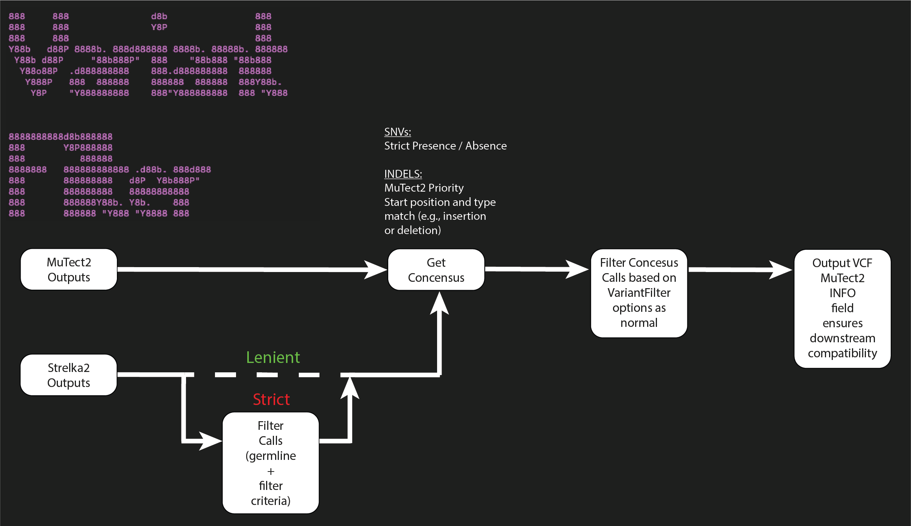

# VariantFilter

Optimized for University of Oxford Research Computing HPC. Also working on Stanford Sherlock and SGC HPCs. Can be adapted and used on others.

# Prerequisites

Python 3.6+. Required modules are in `requirements.txt`. Requirements can be installed using `pip install -r requirements.txt`.

# Usage
Example command line usage:
```
python FilterVariants.py -i AGE_Matched_13Mar2019/mutect2 -a -ref GRCm38.86 -j /users/leedham/rschenck/tools/snpEff/snpEff.jar -t
```

or ask for help

```
python FilterVariants.py --help

2022-10-06 17:06:09,984-INFO: Thank you for using Variant Filter. Created by Ryan Schenck...


888     888               d8b                888    
888     888               Y8P                888    
888     888                                  888    
Y88b   d88P 8888b. 888d888888 8888b. 88888b. 888888 
 Y88b d88P     "88b888P"  888    "88b888 "88b888    
  Y88o88P  .d888888888    888.d888888888  888888    
   Y888P   888  888888    888888  888888  888Y88b.  
    Y8P    "Y888888888    888"Y888888888  888 "Y888 
                                                    
                                                    
                                                    
8888888888d8b888888                   
888       Y8P888888                   
888          888888                   
8888888   888888888888 .d88b. 888d888 
888       888888888   d8P  Y8b888P"   
888       888888888   88888888888     
888       888888Y88b. Y8b.    888     
888       888888 "Y888 "Y8888 888     
                                      
                                      
                                      

usage: FilterVariants.py [-h] [-i INDIR] [--concensus]
                         [--inDirConcensus INDIRCONCENSUS] [-c CALLER] [-ievs]
                         [-nr MINNR] [-vr MINVR] [-vd VARSAMDEPTH]
                         [-af MINVAF] [-e MAXEVENTS] [-l CLUSTERFLANK] [-t]
                         [-u] [--samplemap SAMPLEMAP] [-uvr UMINVR]
                         [-uaf UMINVAF] [-v] [-a] [-ref REF] [-j JARFILE]
                         [-reffasta REFGENOME]

optional arguments:
  -h, --help            show this help message and exit
  -i INDIR              Input directory of vcf files with .passed.vcf
                        extension, in the case of Strelka2 it expects the
                        directory containing all information. Default: ./
  --concensus           Whether to get a concensus call or not. If flag is
                        present the assumed file to keep is the MuTect2 calls.
                        Default=False
  --inDirConcensus INDIRCONCENSUS
                        Directory to look for calls made from secondary caller
                        (supports Strelka2 only). Must be present if
                        --concensus is True.
  -c CALLER             Callers to be used, 1) MuTect2 2) Strelka2 3) Octopus
                        4) Shearwater ML; Default: 1) MuTect2
  -ievs                 Whether to ignore the LowEVS filter on Strelka2
                        output. Default=False. (Only applies for Strelka2
                        caller)
  -nr MINNR             Minimum reads in normal. Default: 10
  -vr MINVR             Minimum variant reads. Default: 2
  -vd VARSAMDEPTH       Total reads at variant site sum(ref,alt). Default=10
  -af MINVAF            Minimum variant allele frequency. Default=0.1
  -e MAXEVENTS          Maximum number of events allowed at a loci. This
                        ignores germline for example. Default=1
  -l CLUSTERFLANK       Flanking region to omit clustered events. Default: 10
  -t                    Flag to build an informative table. Useful for quick R
                        processing without additional Bioconductor packages.
  -u, --usesamplemap    Boolean indicating whether to use same sample filter
                        options. Default: True, must specify --samplemap
                        <file>.
  --samplemap SAMPLEMAP
                        File with sample mapping in comma separated text file.
                        Default: None, required if -u
  -uvr UMINVR           Minimum variant reads if -u setting is present.
                        Default: 2
  -uaf UMINVAF          Minimum variant allele frequency if -u setting is
                        present. Default: 0.005
  -v                    Verbosity setting. Use -v to suppress some stdout.
  -a                    Annotate using snpEff. This requires -ref and -j.
                        Default=F
  -ref REF              Reference genome to be used for snpEff annotations
                        (See http://snpeff.sourceforge.net/index.html).
                        Default=None
  -j JARFILE            snpEff.jar executable (See
                        http://snpeff.sourceforge.net/index.html) Default=None
  -reffasta REFGENOME   Reference genome that the variants are called with. De
                        fault=/well/leedham/users/rschenck/References/Ensembl/
                        GRCm38/Mus_musculus.GRCm38.dna.primary_assembly.fa
```

# Concensus Filtering

Pass the directory with the concensus calls and make sure that a Strelka2 directory with the sample name matches the 'tumor' sample column in the MuTect2 header.
